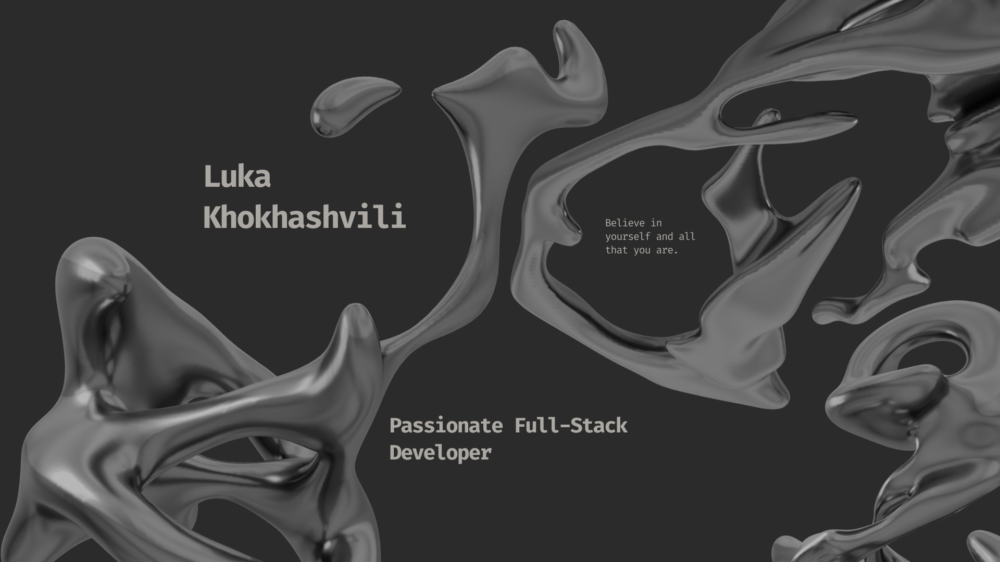

  

---

  <h1 align="center">Hi, I'm Luka! 👋</h1>
  
A passionate Full-Stack Developer with a knack for building beautiful and functional applications.

---

## 👨‍💻 About Me

I'm a passionate full-stack developer, with a strong focus on building responsive and scalable web applications. My journey into tech is driven by a love for creative problem-solving and a desire to build things that people love to use. I am currently on the lookout for a new and challenging role to apply my skills.

**When I'm not coding, you can find me:**
- 📸 **Capturing moments:** I love photography and the art of storytelling through a lens.
- 🎮 **Leveling up:** Whether it's on a PC or console, gaming is a great way to unwind.
- 💪 **Hitting the gym:** I believe in a healthy mind and body, and working out is key to that balance.

---

<h2 align="center">👋 Let's Connect!</h2>

I'm currently open to new opportunities. Reach out if you think I'd be a good fit for your team!

  &nbsp;
  &nbsp;
  &nbsp;
  &nbsp;

---

## 💼 My Current Work

I am currently a **Backend Team Lead** at **Tourlify**, a dynamic and innovative startup. I'm proud to be contributing to their mission by building robust and scalable backend systems.

  

### ✨ My Contributions
- Actively developing key features using **Node.js** and **Express.js**.
- Contributing to database design and optimization with **PostgreSQL** and **MongoDB**.
- Leading a team of developers to implement robust, scalable APIs and services.

---

  <h2>🚀 Skills & Tech</h2>
  &nbsp;
  &nbsp;
  &nbsp;
  &nbsp;
  &nbsp;
  &nbsp;
  &nbsp;
  &nbsp;
  &nbsp;
  &nbsp;
  &nbsp;
  

---

  
  

---

### 📈 My GitHub Activity

  

    
  

  

    <!--  -->
    <!--  -->
  

